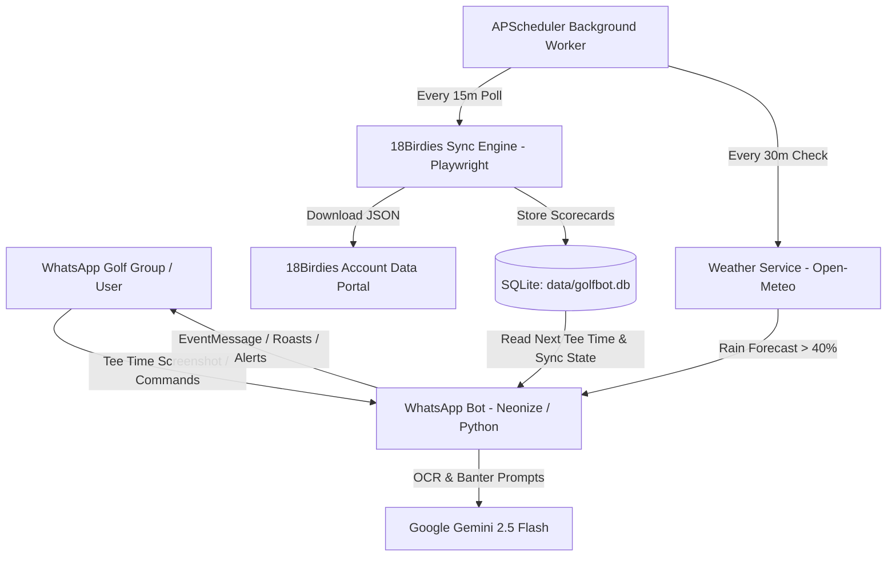

# ⛳ Golf-Bot: Requirements & Technical Specification

> **Status:** Draft / Active Collaboration  
> **Target Environment:** Containerized Docker environment on a dedicated home PC / server  
> **Primary Interfaces:** WhatsApp Group Chat, SQLite Database, 18Birdies Web Portal, Google Gemini API, Open-Meteo API  

---

## 1. Executive Summary & Vision

**Golf-Bot** is an autonomous, containerized WhatsApp assistant for golf buddy groups. The bot operates with the persona of **Jehan Ratnatunga (JehanR)**, the iconic Sri Lankan-Australian comedian from Melbourne turned cheeky golf caddy for his mates. Armed with sharp diaspora observational humor, brown-parent roasts (Amma's Bata slipper, comparisons to high-achieving cousins), short eats advice (mutton rolls and maalu paan in the golf bag), and affectionate banter, he roasts scorecards, guides tee times, and keeps the group laughing.

### Core Objectives:
1. **Automate Tee Time Organization:** Convert club booking app screenshots directly into interactive native WhatsApp group events.
2. **Synchronize Group Golf Data:** Poll and ingest round data from [18Birdies](https://18birdies.com/download-account-data/) for all friends in the group.
3. **Scorecard Analysis & Banter:** Analyze scorecards (GIR, fairways, 3-putts, blowup holes) and automatically post witty, culturally authentic round recaps and roasts to the group.
4. **Proactive Weather Protection:** Track weather for scheduled tee times and alert the group at 24-hour and 2-hour intervals if rain is forecasted.
5. **Interactive Group Chatbot:** Answer queries regarding next tee times, current weather, and golf advice, while engaging in playful golf banter.

---

## 2. System Architecture

---

## 3. Functional Requirements (FR)

### FR-1: Tee Time Screenshot OCR & Native WhatsApp Event Creation
* **Description:** When a user uploads or forwards an image of a tee time booking confirmation from any golf club app (e.g., MiClub, GolfNow, ClubV1, BRS Golf, Chronogolf), the bot must recognize it and create an event.
* **Requirements:**
  1. Multimodal AI (Gemini 2.5 Flash) inspects image bytes and classifies whether it is a golf booking screenshot.
  2. Extracts:
     - `course_name` (e.g., "Royal Colombo Golf Club")
     - `date` (format: `YYYY-MM-DD`)
     - `start_time` (format: `HH:MM`, 24h)
     - `end_time` (calculated as start + 4.5 hours if not explicitly printed)
     - `players` (names of golfers listed in booking)
     - `booking_ref` (confirmation number if visible)
  3. Saves the tee time record into SQLite table `tee_times`.
  4. Generates and sends a native WhatsApp `eventMessage` card to the group chat.
  5. Sends a confirmation text message in Jehan Ratnatunga's voice reminding the group not to show up late with Monash Freeway excuses or forget to pack mutton rolls.

---

### FR-2: Multi-Friend 18Birdies Data Ingestion & Schema Specification
* **Description:** The bot polls and collects scorecard data from [18birdies.com/download-account-data/](https://18birdies.com/download-account-data/) for all friends in the group on a 15-minute schedule.
* **Verified 18Birdies Schema Specification (`myData`):**
  - **Account Data (`myData.accountData`):** `userId`, `userName`, `email`, `mobileNumber`.
  - **Clubs Directory (`myData.clubData.playedClubs`):** List of `{ clubId, name }` (e.g. "Beaconhills Country Golf Club", "Warburton Golf & Sporting Club", "Settlers Run Golf & Country Club"). Used to map internal UUIDs to real course names.
  - **Rounds Archive (`myData.activityData.rounds`):**
    - `id`: Unique round UUID (e.g. `5d13f000-40fc-11f1-a25f-0606d22ea88b`).
    - `timestamp`: Millisecond Unix epoch timestamp (converted to `YYYY-MM-DD`).
    - `clubId.id`: Reference ID mapping to `playedClubs`.
    - `strokes`: Total gross strokes (e.g. 42, 107, 111).
    - `score`: Score relative to par (e.g. `8` for +8, `37` for +37).
    - `holeStrokes`: Array of integer strokes per hole (e.g. 9 or 18 holes).
    - `roundHandicap`: Differential handicap for the round.
    - `stats`:
      - `birdies`, `eagles`, `pars`, `bogeys`, `doubleBogeyOrWorse` (counts per category).
      - `fairwayMiddles`, `fairwayHoleCount` (fairway accuracy calculation).
      - `gir`, `girHoleCount` (Greens in Regulation calculation).
      - `putts` (total putts recorded).
    - `shotEntries`: GPS tracked shots with club type (`WOOD 1` / Driver, `IRON 7`, `WEDGE 52`, etc.) and `distanceInYards` (used to detect the player's longest drive!).
* **Ingestion Requirements:**
  1. Headless Playwright engine downloads archives every 15 minutes to `./data/18birdies/<player_name>_<timestamp>.json`.
  2. Fallback: Monitors `./data/18birdies/` for manual JSON drop-ins.
  3. Updates `player_sync_status` table in SQLite after each poll attempt.

---

### FR-3: SQLite Database & State Management
* **Description:** Local persistent database running in SQLite (`./data/golfbot.db`) across Docker container restarts.
* **Schema Requirements:**
  1. **`tee_times`:**
     - `id`, `course_name`, `date_str`, `start_time`, `end_time`, `players`, `booking_ref`, `latitude`, `longitude`, `whatsapp_event_id`, `created_at`.
  2. **`player_sync_status`:**
     - `player_name` (PK), `email`, `last_attempt_at`, `last_successful_pull_at`, `status`, `rounds_count`, `latest_round_id`, `latest_round_date`, `error_message`.
  3. **`processed_rounds`:**
     - `id`, `player_name`, `round_date`, `course_name`, `total_score`, `score_to_par`, `external_round_id` (UNIQUE), `raw_stats_json`, `summary_posted`, `posted_at`.
  4. **`weather_alerts`:**
     - `id`, `tee_time_id`, `alert_window` (e.g. `24h`, `2h`), `rain_prob`, `precipitation`, `sent_at`, UNIQUE(`tee_time_id`, `alert_window`).

---

### FR-4: Post-Round Scorecard Analysis & Witty Recap
* **Description:** Automatically detect when a friend posts a new round on 18Birdies, compute statistics, and publish a humorous recap in the WhatsApp group.
* **Requirements:**
  1. **Parser & Key Highlights Extraction:**
     - Maps `clubId.id` to course name via `playedClubs`.
     - Extracts total score (`strokes`) and differential (`score` over par).
     - Identifies the worst blowup hole (max stroke in `holeStrokes`) and number of double bogeys+.
     - Identifies standout moments (birdies, eagles, pars, or the longest drive from `shotEntries`, e.g. "289y drive on Hole 8").
     - Tracks putts per hole and fairway accuracy.
  2. **Deduplication:** Checks `is_round_processed(round_id)` in SQLite to ensure no round is roasted more than once.
  3. **Short & Witty Persona Generation:**
     - Prompts Gemini with Jehan Ratnatunga's persona to generate a **short and witty roast (2 to 3 sentences maximum)**.
     - Does NOT regurgitate every number or player detail; focuses strictly on 1 or 2 key highlights (e.g. comedic blowup hole, putting disaster, or rare monster drive).
  4. **Broadcast:** Sends the punchy comment directly to the WhatsApp group.

---

### FR-5: Sri Lankan Golf Caddy Chatbot ("Jehan Ratnatunga")
* **Description:** An interactive conversational agent embodying Jehan Ratnatunga (JehanR)—combining his iconic Sri Lankan-Australian observational comedy, relatable brown parent tropes (Amma's rubber slipper, comparing you to your doctor cousin), and Melbourne diaspora golf banter.
* **Requirements:**
  1. **Voice & Tone (Strict Rule - Short & Witty):**
     - ALL responses MUST be short, punchy, and witty (maximum 2 to 3 sentences).
     - Authentic Sri Lankan-Aussie address: Addresses players as *"Machan"*, *"Bro"*, *"Ado"*, *"Men"*, or *"Ape kollo"*.
     - Trademark hooks: *"Ado machan..."*, *"What men?!"*, *"Aiyo!"*, *"Honestly men..."*, *"Look at this fellow..."*.
     - Relatable comedy themes: Amma's slipper for high scores, spending $900 on carbon drivers just to slice into the trees, packing short eats (mutton rolls, fish buns) in the golf bag, and Melbourne's unpredictable 4-seasons weather.
     - Playful roasting, affectionate guidance, and clubhouse banter.
  2. **Command Handling:**
     - `@caddy when is the next tee time?` / `!teetime`: Returns next booked round details and countdown.
     - `@caddy weather`: Checks forecast and prior rain conditions for the upcoming round.
     - `@caddy sync`: Triggers an immediate 18Birdies pull and posts any new round summaries.
     - `@caddy sync status` / `@caddy status`: Displays table of friends, last pull timestamps, and latest rounds.
     - Natural conversational banter: Answered in-character with short, witty replies.

---

### FR-6: Proactive Rain, Precipitation & Wet Condition Monitoring
* **Description:** Continuous background monitoring of actual precipitation (mm) and ground conditions to keep the group informed.
* **Requirements:**
  1. **Forecast & Past Precipitation Ingestion:**
     - Integrates with Open-Meteo API using course coordinates (`past_days=1` parameter).
     - Computes total precipitation (mm) during the 4-hour round window.
     - Computes prior-day total rainfall (mm) to assess ground saturation and turf conditions.
  2. **Automated Day-Before Weather Brief (24h before tee off):**
     - **`< 1.0 mm` (Good Weather):** Sends a short, witty message confirming clear skies and ideal playing conditions (no excuses for slicing!).
     - **`1.0 - 2.0 mm` (Light Drizzle):** Sends a brief message advising players to expect light drizzle (pack a towel, wipe grips).
     - **`> 2.0 mm` (Weather Warning):** Sends an alert warning of heavy rain/wind (bring waterproof gear or retreat to the 19th hole).
  3. **Wet Ground & Prior Day Rain Commentary:**
     - If rainfall on the day prior was heavy ($\ge 3.0\text{ mm}$), automatically appends a witty warning about soggy fairways, plugged balls, mud, and slow greens.
  4. **2-Hour Pre-Round Follow-up:**
     - Sends a quick final heads-up if drizzle or rain ($\ge 1.0\text{ mm}$) is imminent.
  5. **Deduplication:** Records alerts in `weather_alerts` table to prevent repeated notifications.

---

### FR-7: Lightweight Activity Monitoring Dashboard & Database Event Logging
* **Description:** A simple, lightweight web dashboard running inside the container on port `8080` (accessible via browser at `http://<server-ip>:8080`) to monitor bot health, connectivity, activity logs, counts, and failures.
* **Requirements:**
  1. **Database Event Logging (`activity_logs` table):**
     - Automatically logs key lifecycle events into SQLite:
       - `CONNECTIVITY`: WhatsApp socket connection, pairing code, disconnects.
       - `MESSAGE_RECEIVED`: Incoming commands and questions from friends.
       - `MESSAGE_SENT`: Confirmation of successful message delivery or transmission failures.
       - `TEE_TIME_OCR`: Detection results from booking screenshots.
       - `EVENT_CREATED`: Status of WhatsApp native event generation.
       - `BIRDIES_SYNC`: Success/failure status per player download attempt.
       - `ROUND_ROASTED`: Scorecard parsing and witty summary publication.
       - `WEATHER_ALERT`: Scheduled 24h or 2h weather alert dispatches.
       - `ERROR`: Unhandled exceptions, API errors, or network timeouts.
  2. **Dashboard UI Elements:**
     - **Live Health Status:** Green/Red indicator showing WhatsApp socket connectivity and paired device number.
     - **Performance Metrics Grid:** Live counters for Messages Sent, Messages Received, WhatsApp Events, 18Birdies Syncs, Total Failures, and Rounds Tracked.
     - **18Birdies Sync Health Table:** Per-friend status table displaying last pull timestamp, success/fail badge, latest round date, and error notes.
     - **Upcoming Tee Times Table:** List of scheduled games with course, date, time, and players.
     - **Activity & Failure Log:** Real-time log table with "All" vs. "Failures Only" filter and 10-second automatic polling.
  3. **Zero Overhead Implementation:** Built using Python's standard library `ThreadingHTTPServer` running in a daemon thread. Consumes `< 5MB` RAM with zero additional pip dependencies.

---

## 4. Configuration & Credentials Specification

| Environment Variable | Description | Example / Default |
|---|---|---|
| `GEMINI_API_KEY` | Google AI Studio API key | `AIzaSy...` |
| `GEMINI_MODEL` | Gemini model name | `gemini-2.5-flash` |
| `BOT_NAME` | Bot display name / persona | `Jehan Ratnatunga` |
| `BOT_TRIGGER_KEYWORD` | Trigger keyword in group chats | `@caddy` |
| `BIRDIES_ACCOUNTS` | JSON array or delimited list of friends' credentials | `'[{"name":"Kasun","email":"...","password":"..."}]'` |
| `PLAYERS_CONFIG_PATH` | Path to JSON file for player accounts | `config/players.json` |
| `DEFAULT_COURSE_NAME` | Default course name for weather/tee times | `Beaconhills Golf Club` |
| `DEFAULT_COURSE_LAT` | Course latitude coordinate (Upper Beaconsfield, VIC) | `-38.0845` |
| `DEFAULT_COURSE_LON` | Course longitude coordinate | `145.4385` |
| `TIMEZONE` | Timezone identifier | `Australia/Melbourne` |
| `WEATHER_RAIN_THRESHOLD_PERCENT` | Rain alert threshold | `40` |
| `BIRDIES_SYNC_INTERVAL_MINUTES` | Frequency of background 18Birdies polling | `15` |
| `WEATHER_CHECK_INTERVAL_MINUTES` | Frequency of background weather checks | `30` |
| `DASHBOARD_PORT` | Port for web monitoring dashboard | `8080` |

---

## 5. Non-Functional Requirements (NFR)

1. **Isolation & Portability:** Everything runs inside a single `docker-compose` definition on Python 3.11 with all dependencies (Playwright, Neonize, SQLite) packaged.
2. **Session Persistence:** Host volume mounts `./data:/app/data` persist WhatsApp authentication keys (`data/session/whatsapp.db`), SQLite data, and 18Birdies exports across container restarts or host reboots.
3. **Low Resource Footprint:** Designed to run comfortably on an old PC/laptop (headless Chromium only launches during active pulls and terminates immediately).
4. **Security & Privacy:** Passwords and API keys remain strictly local in `.env` / `players.json`. No telemetry or external databases used.

---

## 6. Open Questions & Future Collaboration Items

- [ ] **18Birdies Login Challenges:** Does 18Birdies enforce CAPTCHA or email 2FA on repeated logins from a new IP? If so, we can implement session cookie reuse or email code forwarding.
- [ ] **Handicap Tracking:** Should the bot calculate net Stableford scores or track handicap differentials across rounds?
- [ ] **Club App Integration:** If you have specific screenshot layouts from your club's booking app (MiClub, GolfNow, etc.), we can refine the Gemini extraction prompt with sample screenshots.
- [ ] **Multiple WhatsApp Groups:** Would you prefer the bot to restrict responses strictly to one group JID, or any group where it is invited?
